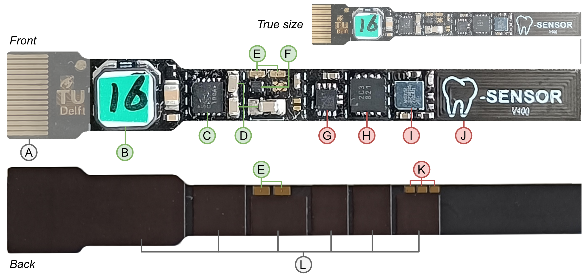
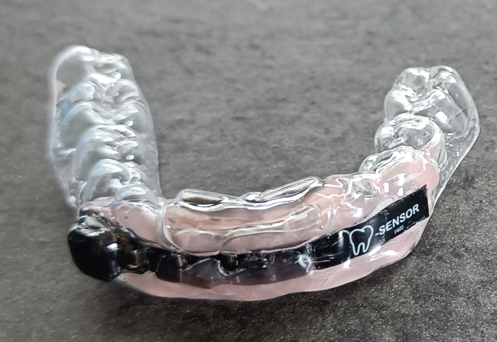

# Densor - TEG harvester
A _Dental Sensor_ is a non-invasive, battery-less, intra-oral sensor. The Densor is embedded in the user's oral cavity and can measure temperature and orientation. It converts temperature differences caused by drinking into useful energy using two Thermal Electric Generators (TEGs).

### The Densor

The figure above shows the final Densor prototype with several labelled components. All components of the Densor are placed on the front of the PCB to reduce complexity when assembling and provide a flat mounting surface. The PCB's bottom side only contains traces and several 0.15 mm polyimide stiffeners **L**. These stiffeners prevent stress on the component during bending and control where the PCB bends. This allows the PCB to bend to a very tight radius without stressing the delicate solder joints. 

The left side of the Densor contains a 14-pin FPC connector **A** used for development. This connector can be cut off once the development is done to reduce the Densors size. Next to the FPC connector, all harvesting components are placed together (labelled in green). The largest component, the LPR6235 coupled inductor **B**, is placed close to the Mercury energy harvester **C** and the three storage capacitors **D**. Two exposed soldering pads on the front and back of the Densor **E** are used to attach the TEGs to the Densor. The XC6136C18 voltage monitor **F** is placed between the harvesting and the sensing section. 

The sensing section (labelled in red) is centred around the NHS3152 microcontroller **I**. The microcontroller is surrounded by the decoupling capacitor, the pre-charge resistor and a voltage divider. On its left, the CY15B104 FRAM **H**, and LIS2DW12 accelerometer **G** are placed. The NFC antenna **J** is placed far away from the harvesting section and the SPI bus to reduce possible interference from the signal switching. The backside of the Densor contains three pads **K** that give access to the programming port of the MCU, even after the FPC connector is removed. 

The Densor has a length of 47.5 mm (without the FPC connector **A**), a width of 7 mm and a maximum height of 3.7 mm. 
The coupled inductor **B** mainly dictates the maximum width and height. Right of the inductor, the Densor is only 5 mm wide and has a maximum thickness of 1.25 mm.

_The full Densor schematic can be found in the hardware folder_

### The Development Board

The Densor's high component density and small size make developing with it challenging. The Densor has no room for test-pad, debugging interfaces or status LEDs. For this reason, a dedicated development board was created. The Densor can be mounted to this board using a single small pitch FPC connector. This gives the development board access to all relevant Densor signals like the SWD programming port, SPI bus and power lines. Once development is done, the FPC connector can be cut off the Densor to reduce its size.

The figure above shows the development board with a Densor mounted in the FPC connector **I**. A Raspberry Pi Pico **A** powers the development board via a micro USB cable and can act as a rudimentary logic analyser or USB-to-SPI bridge. The Pico has some bi-directional level shifters to interact with the Densor. The FPC connecter signals are attached to labelled test points next to the Densor **G**.

A 10-pin programming connector **B** is used to connect a SWD programmer to the Densor. With a 4-pole switch **C**, the programmer can be fully isolated from the Densor. This feature is used when testing the power consumption of the Densor since the programmer can influence these measurements. A reset and wake-up button **D** are placed close to the programming port. 

Several headers **E** allow easy access to the different supply lines and offer the option to power the Densor from the development board or the Power Profiler Kit II. A second header **F** allows to connect any signal to either of the three LEDs or the Pico logic analyser. The four screw headers at the top of the board **H** are used to connect to a power rail or a TEG. 

### Densor in Retainer

The figure above shows the Densor embedded in a retainer

## Copyright

 

Copyright (C) 2024 TU Delft Embedded Systems Group/Sustainable Systems Laboratory.

MIT Licence or otherwise specified. See [license](https://github.com/TUDSSL/ENGAGE/blob/master/LICENSE) file for details.
